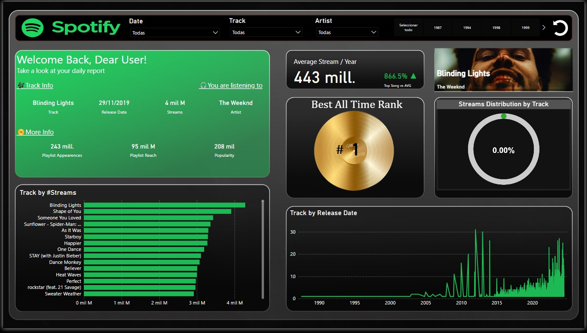

# Spotify Visual Analytics

Este proyecto consiste en la creación de un dashboard interactivo en Power BI utilizando datos de canciones extraídos de la API de Spotify y de un dataset público. El dashboard permite explorar y visualizar información sobre canciones, artistas y métricas relacionadas con la popularidad y el rendimiento de los tracks en diferentes playlists.

## Descripción del Proyecto

### Fuentes de Datos
- Se utilizaron dos fuentes principales de datos:
  1. **API de Spotify**: para obtener información detallada sobre las canciones, los artistas y las imágenes de los álbumes.
  2. **Dataset público de Kaggle**: [Most Streamed Spotify Songs (2024)](https://www.kaggle.com/datasets/nelgiriyewithana/most-streamed-spotify-songs-2024), que contiene información sobre las canciones más reproducidas en Spotify.

### Extracción de Datos
- Se usaron las credenciales `client_id` y `client_secret` para autenticar las solicitudes a la API de Spotify.
- Se buscó cada canción (track) por su artista correspondiente para obtener el `track_id`, lo que permitió extraer información específica del track y detalles adicionales, como la imagen del álbum.
- A través del script `spotify_data_extraction.py`, se actualizaron los datos del archivo CSV, añadiendo las URLs de las imágenes de los álbumes proporcionadas por la API de Spotify.

### Limpieza y Preparación de los Datos
- Se manejaron valores nulos y se verificó la existencia de duplicados en los tracks.
- Las columnas fueron convertidas a sus tipos de datos correctos (fechas, números, etc.).
- Los datos fueron transformados en un archivo limpio (`updated_file.csv`) listo para su uso en el análisis y en la construcción del dashboard.

### Creación del Dashboard
- El fondo del dashboard fue diseñado en PowerPoint para darle un toque visual atractivo.
- En el dashboard, se implementaron los siguientes elementos visuales e interactivos:
  - **Filtros por Fecha, Track, Artista, y Año**: permite segmentar la información.
  - **Track Info**: muestra detalles sobre el track seleccionado, su fecha de lanzamiento y número de streams.
  - **Artista Seleccionado**: muestra información sobre el artista.
  - **More Info**: incluye métricas adicionales como las apariciones en playlists, el alcance de las playlists y la popularidad.
  - **Track by Streams**: gráfico de barras apiladas mostrando los streams por track.
  - **Average Streams / Year**: visualización del promedio de streams por año.
  - **Rank**: clasificación de los tracks.
  - **Stream Distribution by Track**: visualización de la distribución de streams.
  - **Track by Release Date**: gráfico de los tracks organizados por su fecha de lanzamiento.
  - **Imagen del Álbum**: obtenida directamente desde la API de Spotify y añadida al dataset.
  - **Botón para limpiar filtros**: simplifica la exploración del dashboard.

## Requisitos

- [Power BI](https://powerbi.microsoft.com) para visualizar el archivo `.pbix`.
- Acceso a la API de Spotify para la extracción de datos.

## Uso

1. Clona el repositorio:
   ```bash
   git clone https://github.com/usuario/Spotify-Visual-Analytics.git
   ```
2. Añade tus credenciales de Spotify en el script:
   ```python
   client_id = 'your_client_id'
   client_secret = 'your_client_secret'
   ```
3. Ejecuta el script de extracción de datos para agregar las imágenes de los álbumes:
   ```bash
   python scripts/spotify_data_extraction.py
   ```
4. Abre el archivo `spotify_dashboard.pbix` en Power BI.

## Capturas del Dashboard



