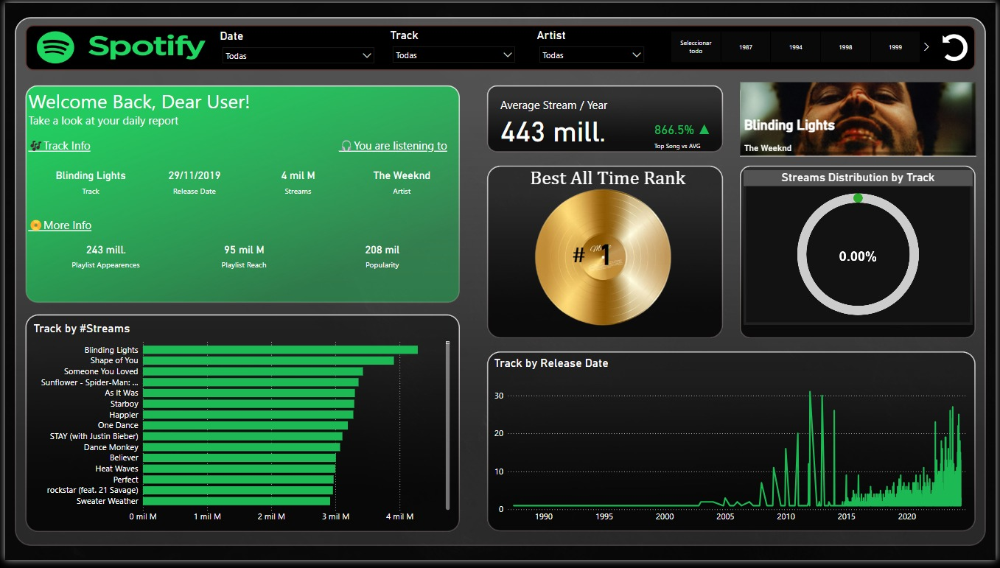

<div align="center">


</div>

---

## 📌 Overview

End-to-end data project combining **Spotify API** live data with the *Most Streamed Spotify Songs 2024* Kaggle dataset to build a fully interactive Power BI dashboard with deep insights into music trends, artist performance, and streaming behavior.

---

## 📊 Dashboard Preview



---

## 🚀 Features

| Feature | Description |
|---|---|
| 🎵 **Track Explorer** | Filter by date, artist, track, and year |
| 📊 **Stream Analytics** | Distribution charts, timeline of releases, streaming counts |
| 🖼️ **Album Art** | Fetched live from Spotify API |
| 📋 **Playlist Reach** | Metrics on playlist appearances and audience reach |
| 📈 **Rank & Averages** | Track ranking and average streams per year |
| 🔄 **Reset Filters** | One-click dashboard reset |

---

## 🔄 Pipeline

```
Spotify API ──┐
              ├──► ETL (Python + Pandas) ──► Cleaned CSV ──► Power BI Dashboard
Kaggle CSV ───┘
```

**ETL Steps:**
- Authenticated requests to Spotify API using `client_id` / `client_secret`
- Searched each track by artist to retrieve `track_id` and album artwork URLs
- Merged with Kaggle streaming metrics dataset
- Handled nulls, duplicates, and type conversions
- Exported `updated_file.csv` ready for Power BI

---

## ⚒️ Tech Stack

| Layer | Tools |
|---|---|
| **Data Extraction** | Spotify API, Kaggle |
| **Processing** | Python, Pandas |
| **Visualization** | Power BI |

---

## ▶️ How to Run

**1. Clone the repo**
```bash
git clone https://github.com/TomasFeiertag/Spotify-Visual-Analytics.git
cd Spotify-Visual-Analytics
```

**2. Install dependencies**
```bash
pip install -r requirements.txt
```

**3. Set your Spotify API credentials**
```python
client_id = "your_client_id"
client_secret = "your_client_secret"
```

**4. Run the ETL script**
```bash
python scripts/spotify_data_extraction.py
```

**5. Open `spotify_dashboard.pbix` in Power BI Desktop**

---

## 👤 Author

**Tomás Feiertag** — Data Scientist · NLP & LLMs @ Movistar

[](https://linkedin.com/in/tfeiertag/)
[](https://github.com/TomasFeiertag)


